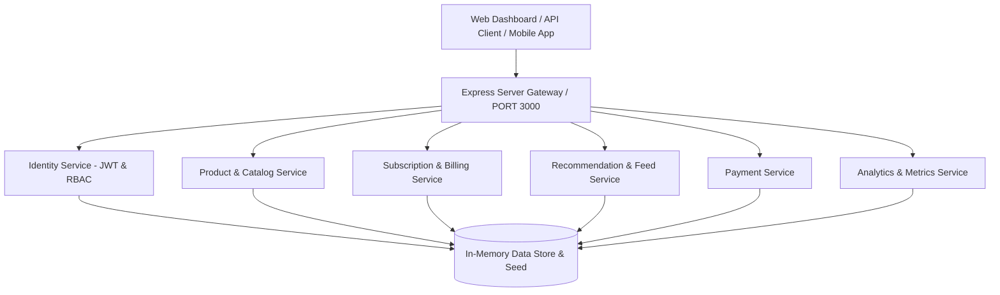

# NexusForge Engine

> **API-First Universal Digital Product, Subscription & Analytics Operating System**

[](http://localhost:3000)
[](https://nodejs.org)
[](tests)

**NexusForge Engine** is a high-performance, modular digital commerce platform and developer engine. Built for modern digital products, developer tools, AI micro-SaaS, and multi-tier subscription applications, it provides complete out-of-the-box infrastructure for catalog management, user identity & RBAC, recurring billing & entitlement enforcement, recommendation algorithms, activity feed streaming, and operational analytics.

##  Key Features

- **Runnable API Server:** Production-grade REST API server built with Express and modular domain routing.
- **Glassmorphic Web Dashboard:** Sleek, dark-mode operations center (`http://localhost:3000`) with real-time analytics graphs, product browser, entitlement matrix, activity feed, and API playground.
- **Identity & Role-Based Access Control (RBAC):** JWT authentication, bcrypt password hashing, user registration, profile management, and role authorization (`admin`, `customer`).
- **Digital Product Catalog:** Full CRUD catalog operations with tag/category filtering, fuzzy text search, stock tracking, and pricing models.
- **Subscription & Entitlement Matrix:** Multi-tier subscription lifecycle engine (`TRIAL`, `ACTIVE`, `PAST_DUE`, `PAUSED`, `CANCELLED`) with instant tier checks (`FREE`, `PREMIUM`, `ENTERPRISE`), upgrades, and downgrades.
- **Recommendation & Feed Engine:** Algorithmic similarity calculator, category affinity scoring based on user interaction events, and session mood feeds.
- **Payment & Order Processing:** Payment transaction handler with idempotency support, receipt generation, and refund workflows.
- **Real-Time Analytics Telemetry:** Centralized event collection pipeline, revenue aggregation, daily activity trend graphs, and system health status.
- **CLI Developer Tooling:** Executable CLI (`npx nexusforge start|seed|status`) for instant local setup.

---

##  Architecture Overview



---

## Quick Start

### 1. Installation

```bash
npm install
```

### 2. Start Server & Dashboard

```bash
npm start
# or via CLI
node bin/nexusforge.js start
```

Open your browser at **[http://localhost:3000](http://localhost:3000)** to launch the NexusForge Operations Dashboard.

#### Demo Credentials:
- **Administrator:** `admin@nexusforge.io` / `admin123`
- **Customer User:** `demo@nexusforge.io` / `demo123`


##  Running Automated Tests

NexusForge Engine includes zero-dependency unit, integration, API, and E2E test suites powered by Node's native test runner (`node --test`).

```bash
# Run all tests
npm test

# Run specific test suites
npm run test:unit
npm run test:api
npm run test:e2e
```


##  API Domain Catalog

| Domain | Base Path | Endpoints |
| :--- | :--- | :--- |
| **Health** | `/health` | `GET /health` |
| **Auth** | `/v1/auth` | `POST /register`, `POST /login`, `POST /logout`, `POST /refresh` |
| **Users** | `/v1/users` | `GET /`, `GET /:id`, `PATCH /:id`, `GET /:id/subscriptions`, `GET /:id/entitlements` |
| **Products** | `/v1/products` | `GET /`, `GET /:id`, `POST /`, `PUT /:id`, `DELETE /:id`, `GET /categories` |
| **Recommendations** | `/v1/recommendations` | `GET /:userId`, `GET /similar/:productId`, `POST /events`, `POST /feedback` |
| **Feed** | `/v1/feed` | `POST /sessions`, `POST /sessions/:id/moods`, `GET /sessions/:id/items` |
| **Subscriptions** | `/v1/subscriptions` | `GET /subscription/plans`, `POST /`, `GET /:id`, `POST /:id/upgrade`, `POST /:id/cancel`, `POST /:id/resume` |
| **Payments** | `/v1/payments` | `POST /`, `GET /:id`, `POST /:id/refund` |
| **Analytics** | `/v1/analytics` | `GET /dashboard`, `POST /events`, `GET /events`, `GET /feed` |

---

##  Repository Structure

```text
nexusforge-engine/
├── apps/
│   └── web/                   # Dark glassmorphic operations dashboard UI
│       ├── index.html
│       ├── styles.css
│       └── app.js
├── bin/
│   └── nexusforge.js          # Executable CLI tool
├── database/
│   └── store.js               # In-memory database repository & seed engine
├── services/                  # Modular backend domain services
│   ├── identity/
│   ├── product/
│   ├── subscription/
│   ├── recommendation/
│   ├── payment/
│   └── analytics/
├── src/
│   └── server.js              # Express REST API server & middleware
├── tests/                     # Automated test suites
│   ├── unit/
│   ├── api/
│   └── e2e/
├── docs/                      # Technical documentation & schemas
├── .env.example
├── package.json
└── README.md
```
